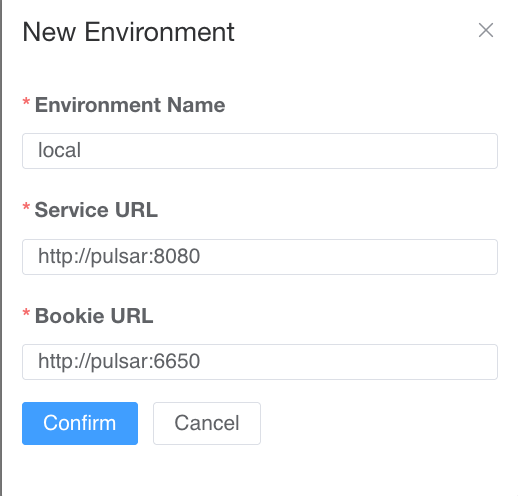

# Demo Debezium Pulsar

## Overview

This repository provides a demo setup for Debezium and Apache Pulsar integration. It includes configuration steps for Pulsar Manager, enabling you to monitor and manage your Pulsar clusters easily.

## Accessing Pulsar Manager Console

To set up the Pulsar Manager console for the first time, you need to configure the initial password. Follow these steps carefully:

1. **Edit the Docker Compose File**:
   - Comment out the `infinity` entrypoint.
   - Uncomment the `init.sh` entrypoint to set the password in Pulsar Manager for the first time.

    ```yaml
    # entrypoint: ["sh", "-c", "sleep infinity"]
    entrypoint: ["sh", "/init.sh"] # Uncomment to set the username and password to admin:apachepulsar. Comment this line after the initial setup.
    ```

2. **Run the Setup**:
   - Execute the Docker Compose setup to initialize the Pulsar Manager with the default username and password.

3. **Revert the Changes**:
   - After the initial setup, revert the changes in the Docker Compose file to prevent creating multiple admin users.

    ```yaml
    entrypoint: ["sh", "-c", "sleep infinity"] # Revert to this after the initial setup
    ```

**Important**: Do not let this setup run multiple times without reverting the changes; otherwise, multiple admin users will be created, and will brick the Pulsar Manager.

## Pulsar Manager Login

Access the Pulsar Manager console at `http://localhost:9527/` with the following credentials:

- **Username**: `admin`
- **Password**: `apachepulsar`

## Configuring a New Environment

Once logged in, create a new environment with the following configuration:

- **Environment Name**: `local`
- **Service URL**: `http://pulsar:8080`
- **Bookie URL**: `http://pulsar:6650`



For more detailed instructions on configuring the environment, refer to the [Pulsar Manager Configuration Guide](https://github.com/apache/pulsar-manager/tree/master?tab=readme-ov-file#configure-environment).

## Additional Resources

- [Debezium Documentation](https://debezium.io/documentation/reference/)
- [Apache Pulsar Documentation](https://pulsar.apache.org/docs/)

## Troubleshooting

If you encounter any issues, please check the following:

- Ensure Docker and Docker Compose are installed and running correctly.
- Verify network configurations and firewall settings.
- Consult the official documentation and community forums for support.

---